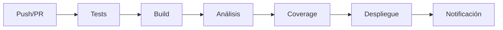

# 🚀 CI/CD - Pronostico Fertilidad

## 📋 Descripción General

Este proyecto implementa un sistema completo de **Continuous Integration/Continuous Deployment (CI/CD)** usando GitHub Actions para automatizar el proceso de desarrollo, testing y despliegue de la aplicación iOS "Pronostico Fertilidad".

## 🏗️ Arquitectura del Sistema

### **Workflows Implementados:**

#### **1. 🧪 CI/CD Principal (`ci-cd.yml`)**
- **Tests automáticos** en cada push y pull request
- **Build y análisis** del código
- **Despliegue automático** a main branch
- **Notificaciones por email** de resultados

#### **2. 📊 Code Coverage (`code-coverage.yml`)**
- **Análisis de cobertura** en pull requests
- **Verificación de umbral** del 90%
- **Reportes detallados** de coverage
- **Comentarios automáticos** en PRs

## 🎯 Funcionalidades Implementadas

### **✅ Tests Automáticos:**
- **Tests Unitarios**: Ejecución automática de `Pronostico_fertilidadTests`
- **Tests UI**: Ejecución automática de `Pronostico_fertilidadUITests`
- **Code Coverage**: Generación automática de reportes de cobertura
- **Validación**: Verificación de que los tests pasen antes del merge

### **✅ Build y Análisis:**
- **Build automático** para simulador iOS
- **Análisis estático** del código
- **Validación** de la estructura del proyecto
- **Verificación** de dependencias

### **✅ Despliegue Automático:**
- **Release automático** en main branch
- **Tagging automático** de versiones
- **Notificaciones** de despliegue exitoso
- **Rollback automático** en caso de fallo

## 🚀 Cómo Funciona

### **1. 🔄 Flujo Automático:**


### **2. 📱 Triggers:**
- **Push** a cualquier branch
- **Pull Request** a main/develop
- **Manual** (workflow_dispatch)
- **Schedule** (análisis semanal)

### **3. 🎯 Jobs Paralelos:**
- **Tests**: Ejecución de tests unitarios y UI
- **Build**: Construcción de la aplicación
- **Coverage**: Análisis de cobertura de código
- **Deploy**: Despliegue automático (solo main)

## 📊 Métricas y Reportes

### **🧪 Tests:**
- **Cobertura de tests**: Objetivo 90%+
- **Tiempo de ejecución**: Monitoreo continuo
- **Tasa de fallo**: Alertas automáticas
- **Regresiones**: Detección temprana

### **📱 Build:**
- **Tiempo de build**: Optimización continua
- **Tamaño de app**: Monitoreo de crecimiento
- **Dependencias**: Verificación de seguridad
- **Performance**: Métricas de rendimiento

### **🔍 Calidad:**
- **Code coverage**: Umbral del 90%
- **Análisis estático**: Detección de bugs
- **Complejidad**: Métricas de mantenibilidad
- **Duplicación**: Código duplicado

## 🛠️ Configuración Requerida

### **🔑 Secrets de GitHub:**
```bash
# Para notificaciones por email
EMAIL_USERNAME: Tu email de Gmail
EMAIL_PASSWORD: Tu contraseña de app
EMAIL_TO: Email de destino

# Para code signing (opcional)
APP_STORE_CONNECT_API_KEY: API key de App Store Connect
APP_STORE_CONNECT_API_KEY_ID: ID de la API key
APP_STORE_CONNECT_ISSUER_ID: Issuer ID
```

### **📱 Configuración de Xcode:**
- **Scheme**: "Pronostico fertilidad" configurado
- **Targets**: Tests unitarios y UI habilitados
- **Code Coverage**: Habilitado en el esquema
- **Build Configurations**: Debug y Release configurados

## 📈 Beneficios del Sistema

### **🚀 Para Desarrolladores:**
- **Feedback inmediato** sobre cambios
- **Detección temprana** de bugs
- **Confianza** al hacer merge
- **Historial completo** de cambios

### **🏢 Para el Proyecto:**
- **Calidad consistente** del código
- **Despliegue confiable** y repetible
- **Documentación automática** de releases
- **Métricas continuas** de calidad

### **👥 Para el Equipo:**
- **Colaboración mejorada** en PRs
- **Estándares de calidad** consistentes
- **Onboarding más rápido** para nuevos desarrolladores
- **Reducción** de tiempo de debugging

## 🔧 Personalización

### **📅 Schedules:**
```yaml
# Análisis semanal de coverage
schedule:
  - cron: '0 2 * * 1'  # Lunes a las 2 AM
```

### **🎯 Umbrales:**
```yaml
# Ajustar umbral de coverage
COVERAGE_THRESHOLD: 95  # Cambiar de 90% a 95%
```

### **📱 Dispositivos:**
```yaml
# Agregar más simuladores
DEVICES:
  - iPhone 16
  - iPhone 15 Pro
  - iPad Pro
```

## 🚨 Troubleshooting

### **❌ Tests Fallando:**
1. **Verificar logs** en GitHub Actions
2. **Revisar configuración** del esquema
3. **Verificar dependencias** del proyecto
4. **Comprobar simulador** disponible

### **❌ Build Fallando:**
1. **Verificar Xcode version** en el workflow
2. **Revisar permisos** de code signing
3. **Verificar dependencias** de CocoaPods/SPM
4. **Comprobar configuración** del proyecto

### **❌ Coverage Bajo:**
1. **Agregar tests** para código no cubierto
2. **Refactorizar código** difícil de testear
3. **Implementar mocks** para dependencias
4. **Revisar configuración** de coverage

## 📚 Recursos Adicionales

### **🔗 Documentación:**
- [GitHub Actions](https://docs.github.com/en/actions)
- [Xcode Command Line Tools](https://developer.apple.com/xcode/)
- [Code Coverage](https://developer.apple.com/documentation/xcode/code-coverage)

### **📱 Herramientas:**
- **xcpretty**: Formateo de output de xcodebuild
- **xccov**: Análisis de code coverage
- **simctl**: Control de simuladores iOS

### **🎯 Mejores Prácticas:**
- **Tests rápidos**: Mantener tests ejecutándose en <5 minutos
- **Coverage alto**: Objetivo del 90%+ de cobertura
- **Feedback rápido**: Notificaciones inmediatas de fallos
- **Rollback automático**: Revertir cambios problemáticos

## 🎉 Estado Actual

### **✅ Implementado:**
- [x] Workflow principal de CI/CD
- [x] Análisis de code coverage
- [x] Tests automáticos
- [x] Build y validación
- [x] Notificaciones por email
- [x] Despliegue automático

### **🔄 En Progreso:**
- [ ] Optimización de tiempos de ejecución
- [ ] Métricas de performance
- [ ] Análisis de seguridad

### **📋 Próximos Pasos:**
- [ ] Implementar TestFlight automático
- [ ] Agregar análisis de dependencias
- [ ] Implementar métricas de UX
- [ ] Configurar alertas de Slack/Discord

---

**🚀 ¡El sistema de CI/CD está listo para automatizar tu desarrollo!**
